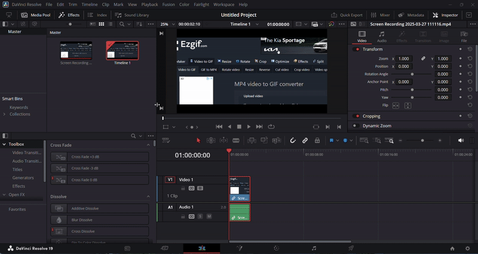
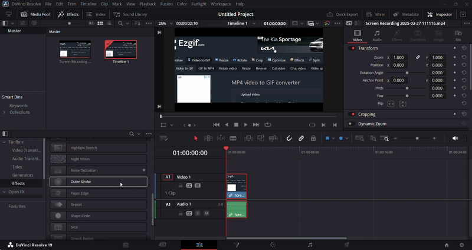
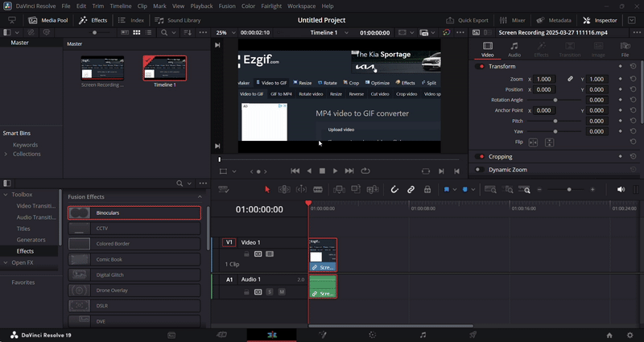
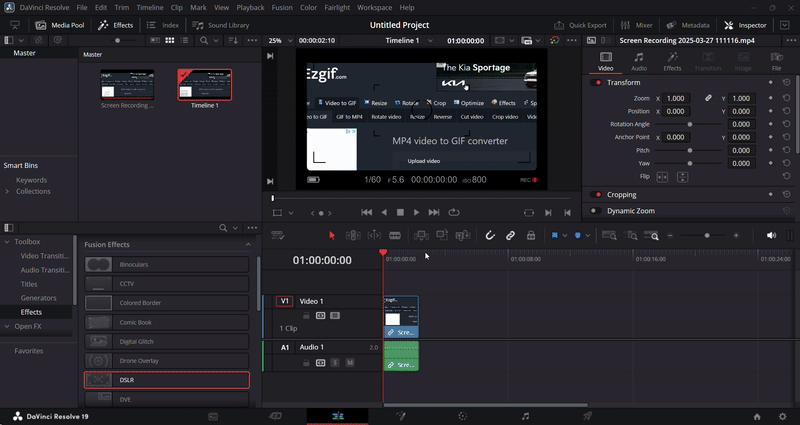
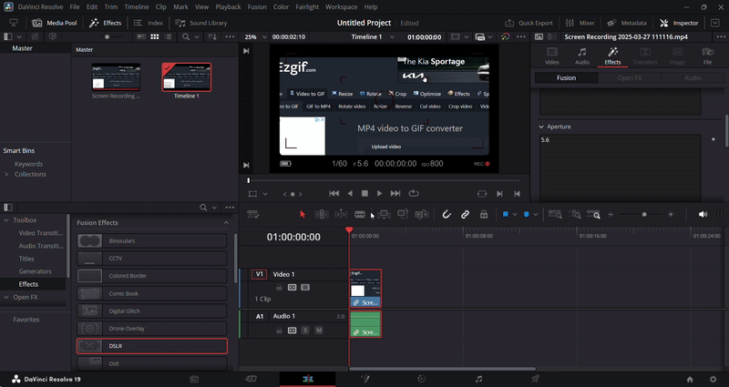

## Applying Effects in DaVinci Resolve

#### Overview

DaVinci Resolve allows you to enhance your video clips with visual and audio effects. These effects can adjust colors, create motion, or apply stylized filters. This section will guide you through accessing the effects library, applying them to your clips, customizing their settings, and previewing the final result before exporting.

#### Navigate to the Edit Page
1. Switch to the **Edit** page using the bottom navigation panel

    {: style="width:600px; height:350px; display: block; margin: 0 auto"}

#### Access the Toolbox
1. Locate the bottom-left panel

    {: style="width:600px; height:350px; display: block; margin: 0 auto"}

2. Click on the **Toolbox** tab

    {: style="width:600px; height:350px; display: block; margin: 0 auto"}

#### Select Effects
1. Click on the **Effects** tab

    {: style="width:600px; height:350px; display: block; margin: 0 auto"}

#### Choose an Effect
1. Browse the available effects
2. Hover over options to see previews
3. Select your desired effect

    {: style="width:600px; height:350px; display: block; margin: 0 auto"}

#### Apply the Effect
1. Click and drag your chosen effect onto a clip

    {: style="width:600px; height:350px; display: block; margin: 0 auto"}

#### Customize the Effect
1. Select the clip with applied effect
2. Open the **Effects** panel
3. Adjust parameters:
    - Custom settings specific to the effect

        {: style="width:600px; height:350px; display: block; margin: 0 auto"}

#### Preview the Result
1. Play the clip in the **Preview** window

    {: style="width:600px; height:350px; display: block; margin: 0 auto"}

#### Refine as Needed
1. Repeat adjustments as needed
2. Try different effects if unsatisfied

!!! success
    You have successfully added effects to your video! You can move on to the next section.