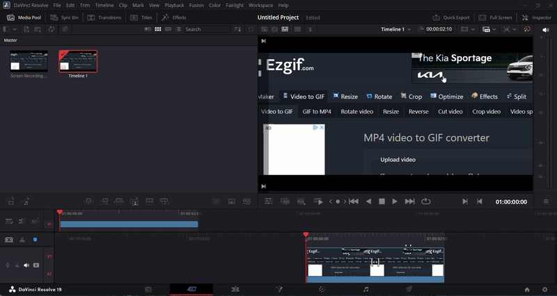
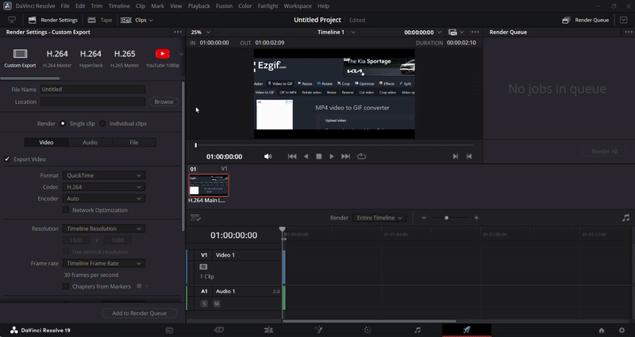
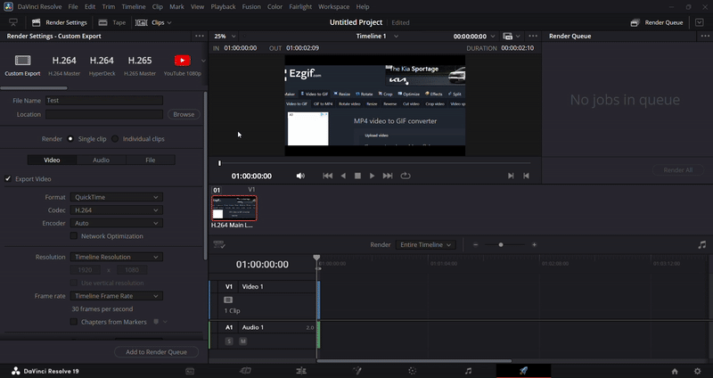
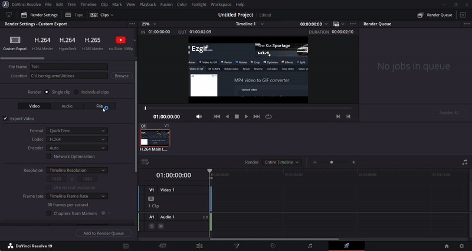
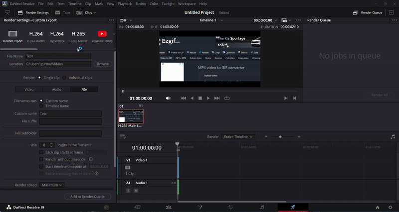
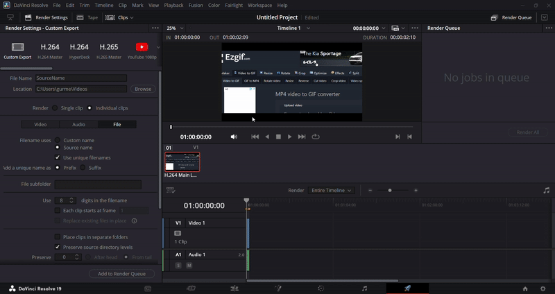
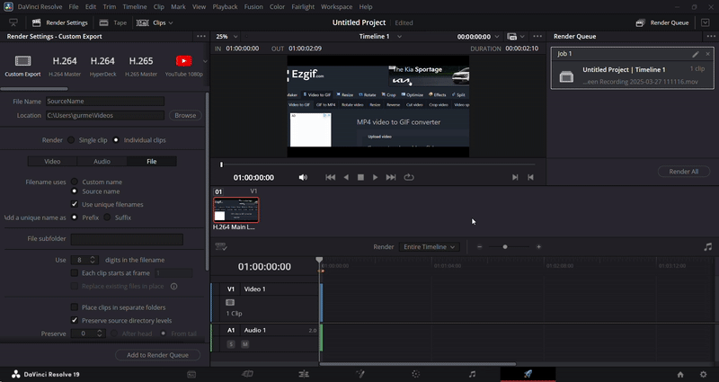
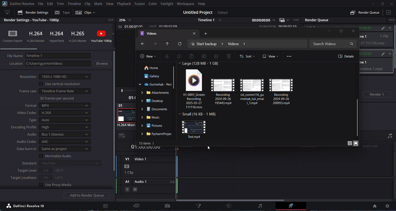

## Rendering Your Project in DaVinci Resolve

#### Navigate to the Deliver Page
1. Switch to the **Deliver** page using the bottom navigation panel

    {: style="width:600px; height:350px; display: block; margin: 0 auto"}

#### Set Project Name and Destination
1. In the **Render Settings** panel:
    - Enter your project name
    - Click **Browse** to choose save location

    {: style="width:600px; height:350px; display: block; margin: 0 auto"}

2. Select a destination folder with sufficient storage space

    {: style="width:600px; height:350px; display: block; margin: 0 auto"}

#### Configure Render Settings
1. Adjust settings manually:
    - Format (QuickTime, MP4, etc.)
    - Codec (H.264, DNxHR, etc.)
    - Resolution and frame rate
    - Quality settings

        {: style="width:600px; height:350px; display: block; margin: 0 auto"}

2. **OR** select from presets:
    - YouTube/Vimeo presets
    - Broadcast standards
    - Custom saved presets

        {: style="width:600px; height:350px; display: block; margin: 0 auto"}

#### Start the Render Process
1. Verify settings in the render queue
2. Click **Add to Render Queue**

    {: style="width:600px; height:350px; display: block; margin: 0 auto"}

3. Click **Render All** to begin

    {: style="width:600px; height:350px; display: block; margin: 0 auto"}

#### Monitor the Render
1. Watch the progress bar
2. Check estimated time remaining
3. View completed file size estimation

#### Locate Your Rendered File
1. After completion, navigate to your chosen destination
2. Play the video to verify quality

    {: style="width:600px; height:350px; display: block; margin: 0 auto"}

!!! warning "Important Notes"
     - **Do not close** DaVinci Resolve during rendering
     - Avoid running other hardware-intensive software
     - Ensure adequate power supply (for laptops)
     - Monitor storage space during long renders