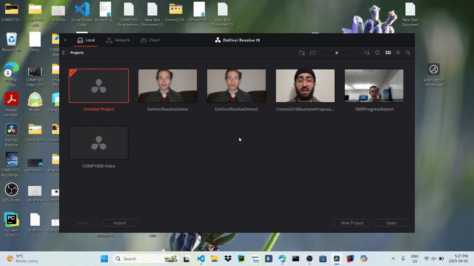
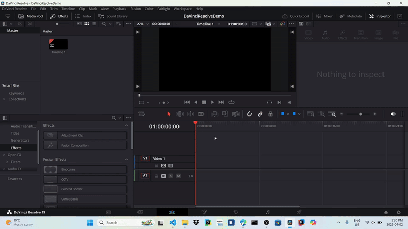
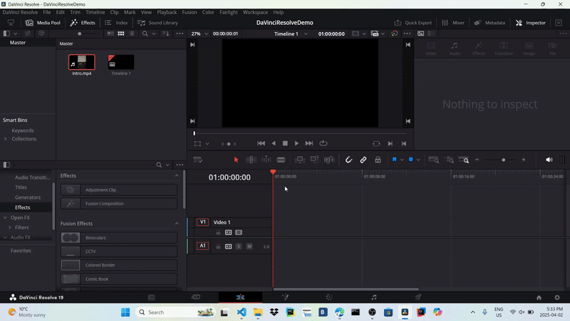

## Seting up the project

#### Overview

This section will help you set up your project so you can begin editing. We’ll cover creating a new project, importing footage, and saving your project.

#### Create a new project

1. Open DaVinci Resolve. It will automatically launch the project manager
2. Press “new project” to create a new project
{: style="width:600px; height:350px; display: block; margin: 0 auto"}
3. Enter the name of your project

#### Import video footage

1. Go to *File->Import->Media* and import the video files you want to edit. Alternatively, you can press **Cntrl + I**
{: style="width:600px; height:350px; display: block; margin: 0 auto"}

!!! info
    After importing the first video file, DaVinci Resolve might ask you to change your project framerate. Select Change and continue.

!!! warning
    You may get an error saying DaVinci Resolve can't read the file you imported. This is because your laptop can't read all video files. We recommend using .mp4 video files to avoid this.

#### Save your project
1. Go to *File->Save Project* and save your project. Alternatively, you can press **Cntrl + S**
{: style="width:600px; height:350px; display: block; margin: 0 auto"}

!!! info
    DaVinci Resolve should automatically save your work. However, we encourage you to manually save after major steps so that your work isn't lost if DaVinci Resolve crashes.

!!! success
    You have successfully set up your project! You can move on to the next section.

