## Assembling the timeline

#### Overview

DaVinci Resolve stores all of the video clips in a timeline. This timeline is how you organize your clips in your video, and will be rendered to produce the final result. This section will help you add tracks to your timeline, add your footage to the corresponding timelines, cut the footage if needed, and preview the final video in the Preview window.

#### Add tracks to your timeline

The timeline is organized into seperate tracks. For each clip that will appear simultaneously in your final video, you will need to add a track for it. For example, if you plan to have a video, a background, and audio file all playing at the same time, then you will need two video tracks and one audio track. However, if you only plan to have one video clip and one audio clip playing at the same, then you only need one video and one audio track. These steps will help you add additonal tracks.
!!! info
    Don't know how many video and audio tracks you need? Just make sure there is one video track and one audio track. You can always add more later.

1. Navigate to Edit page
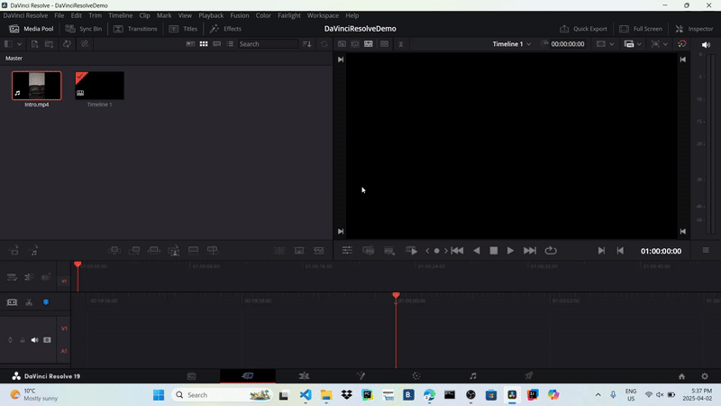{: style="width:600px; height:350px; display: block; margin: 0 auto"}
2. See if there are already enough tracks. DaVinci Resolve might already added an audio track and video track by default. The following gif shows you where the tracks would appear if they were automatically added.
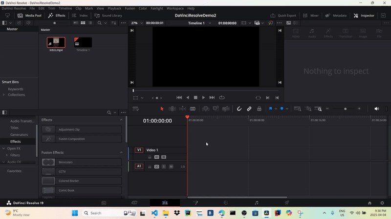{: style="width:600px; height:350px; display: block; margin: 0 auto"}
3. Right-click on the Tools tab and select Add Tracks
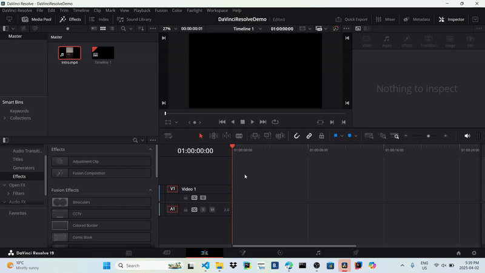{: style="width:600px; height:350px; display: block; margin: 0 auto"}
4. Enter the number of additional Audio and Video Tracks you need and press Add Tracks. The following gif shows what adding two more video and audio tracks would look like, but your amount will be different.
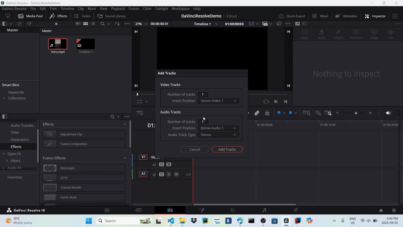{: style="width:600px; height:350px; display: block; margin: 0 auto"}
!!! info
    Added too many tracks? You can always right click on a track and select Delete.

#### Add footage to your timeline

1. Select Snap Mode. This will help your videos snap together, ensuring that there is no gap in your timeline. This should be enabled by default.
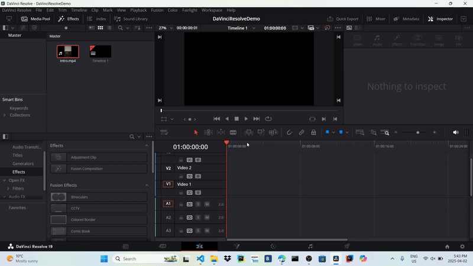{: style="width:600px; height:350px; display: block; margin: 0 auto"}
2. Select Link Mode. This will ensure that as you move your video, the corresponding audio moves too. This should be enabled by default.
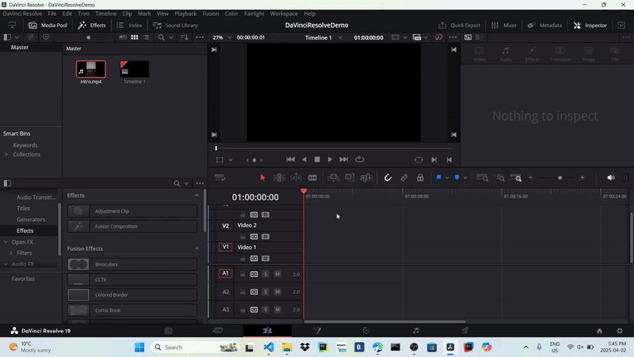{: style="width:600px; height:350px; display: block; margin: 0 auto"}
3. Drag and drop each video file into the correct position on the correct track. Remember, footage will be played in the order that it appears on the track, so place your footage in the order it should appear
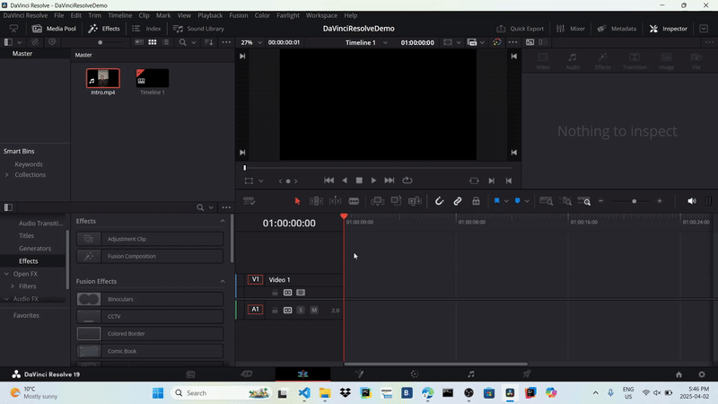{: style="width:600px; height:350px; display: block; margin: 0 auto"}
4. Ensure the first clip is at the start of the timeline. Otherwise, there will be a gap at the start of the video where there is just a black screen.
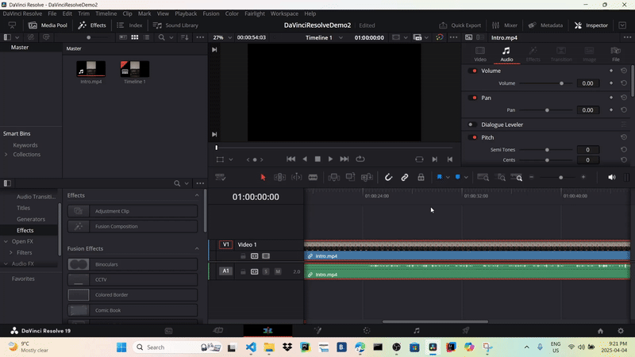{: style="width:600px; height:350px; display: block; margin: 0 auto"}
5. Ensure there are no gaps between clips. Otherwise, there will be gaps in the final video where there is just a black screen.
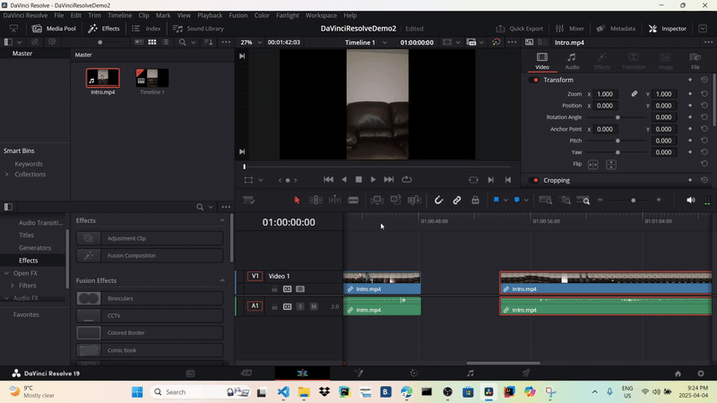{: style="width:600px; height:350px; display: block; margin: 0 auto"}

#### Cut your footage

For each video clip, you may want to cut some part of it out. These steps will show you how to cut a video clip. Please use these steps as needed.

1. Select Blade Edit Mode. By default, you should be using Select Mode.
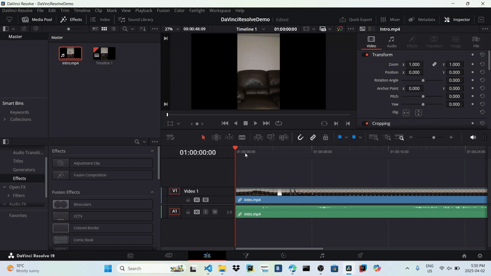{: style="width:600px; height:350px; display: block; margin: 0 auto"}
2. Click on the start and end of the section in the footage you would like to cut
{: style="width:600px; height:350px; display: block; margin: 0 auto"}
3. Select Select Mode
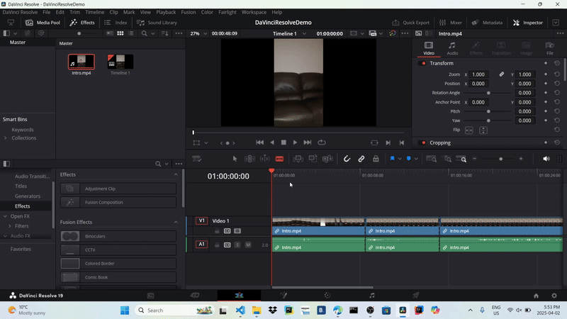{: style="width:600px; height:350px; display: block; margin: 0 auto"}
4. Right click on the footage you would like to cut and select Delete.
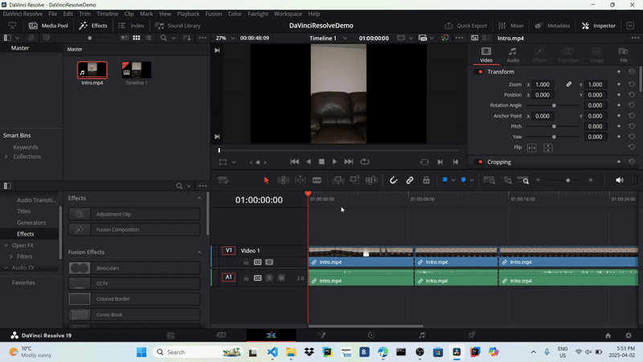{: style="width:600px; height:350px; display: block; margin: 0 auto"}
!!! info
    If you want to undo this delete, or any action in general, simply press **Cntrl + Z** or go to *Edit->Undo*.
5. Adjust the timeline as needed.
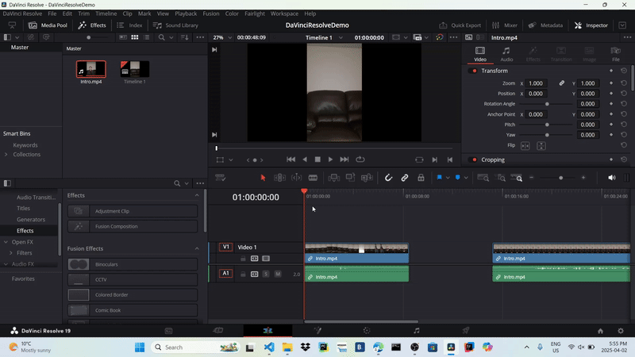{: style="width:600px; height:350px; display: block; margin: 0 auto"}

#### Preview your video

1. Move the playhead bar to where you would like the preview to start.
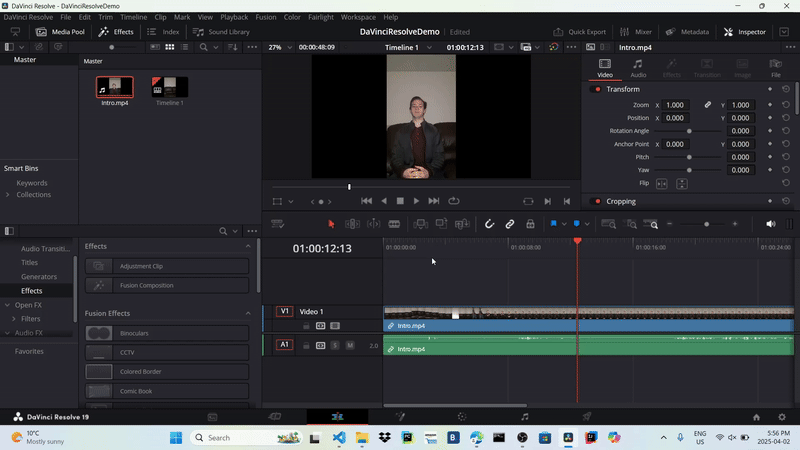{: style="width:600px; height:350px; display: block; margin: 0 auto"}
2. Press the play button to see the preview
{: style="width:600px; height:350px; display: block; margin: 0 auto"}
!!! info
    The preview video might lag when playing. This is because DaVinci Resolve is rendering the video in real time. The final video will play properly after rendering.
!!!success
    You have successfully assembled your project timeline! You can move on the next section.
