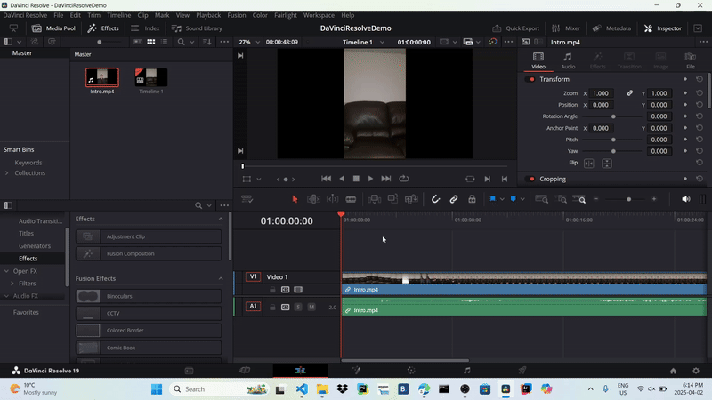
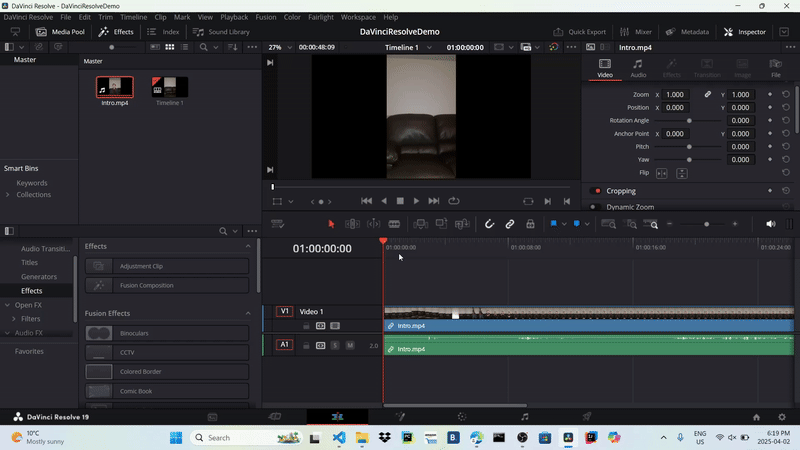
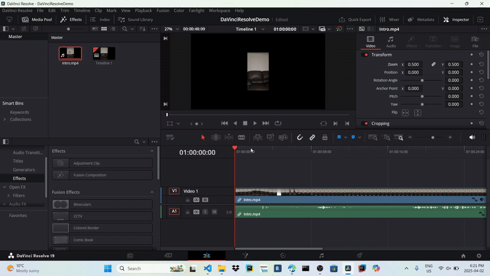
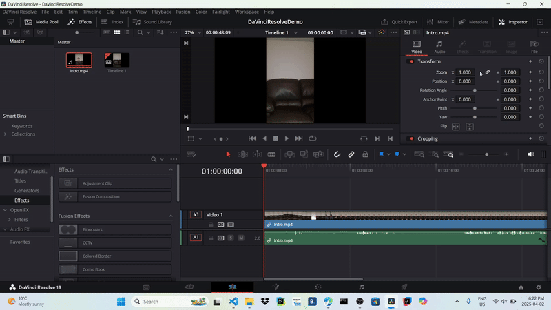
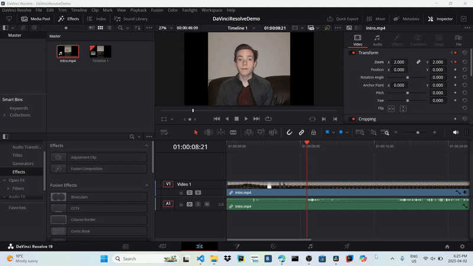

## Apply Transform Edits

#### Overview

More complex editing options, like cropping, zooming in, or changing the audio volume, can be accessed in the Transform or Crop Tab in the Edit page. This section will give you optional steps for different editing options you can apply to your footage. Please use these steps as needed.

!!! info
    For each edit you do, make sure to select the clip in your timeline that you want to edit.

#### Change the footage's position on the screen

1. Navigate to the Transform Tab and enter the new x and y positions for the footage
{: style="width:600px; height:350px; display: block; margin: 0 auto"}

#### Zoom in/Zoom out

1. Navigate to the Transform Tab and enter the new zoom value
{: style="width:600px; height:350px; display: block; margin: 0 auto"}

#### Rotate footage

1. Navigate to the Transform Tab and either enter the new rotation angle or use the slider
{: style="width:600px; height:350px; display: block; margin: 0 auto"}

#### Flip footage

1. Navigate to the Transform Tab and flip the image horizontally, vertically, or both
{: style="width:600px; height:350px; display: block; margin: 0 auto"}

#### Crop Footage

1. Navigate to the Crop Tab
{: style="width:600px; height:350px; display: block; margin: 0 auto"}
2. Find the Crop option you’d like to use. You can Crop the top, left, right, or bottom and enter the new crop value
{: style="width:600px; height:350px; display: block; margin: 0 auto"}

#### Adjust Opacity

1. Navigate to the Composite Tab and either enter the new opacity value or use the slider.
{: style="width:600px; height:350px; display: block; margin: 0 auto"}

#### Adjust Volume

1. Navigate to the Audio Tab and enter the new volume value
{: style="width:600px; height:350px; display: block; margin: 0 auto"}

#### Use Keyframes for more complex edits

You might want to more complex edits that play during the video. For example, you might want the video clip to zoom in as the video progresses. These steps will help you use keyframes to apply these special effects.

1. Move the playhead bar to the frame that the special effect should start
2. Enter the starting value of the effect
{: style="width:600px; height:350px; display: block; margin: 0 auto"}
3. Add a keyframe for the effect
{: style="width:600px; height:350px; display: block; margin: 0 auto"}
4. Move the playhead bar to the frame that the special effect should finish
5. Enter the ending value for the effect
6. Move to the previous keyframe and preview the change
{: style="width:600px; height:350px; display: block; margin: 0 auto"}

!!! success
    You have successfully used the transform tab to edit your video! You can move on to the next section.