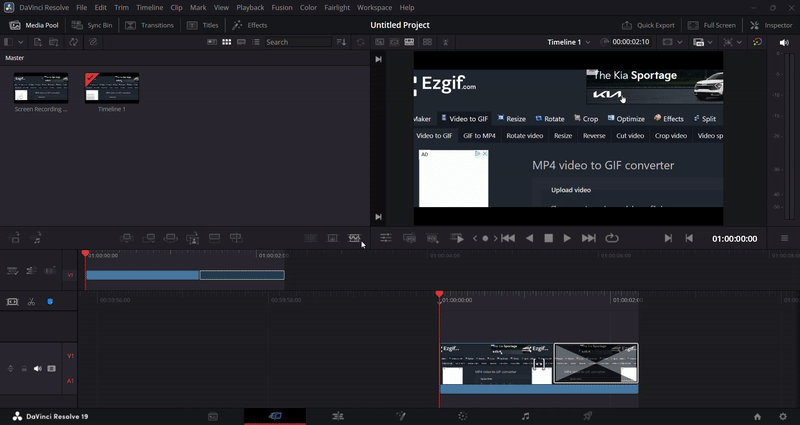
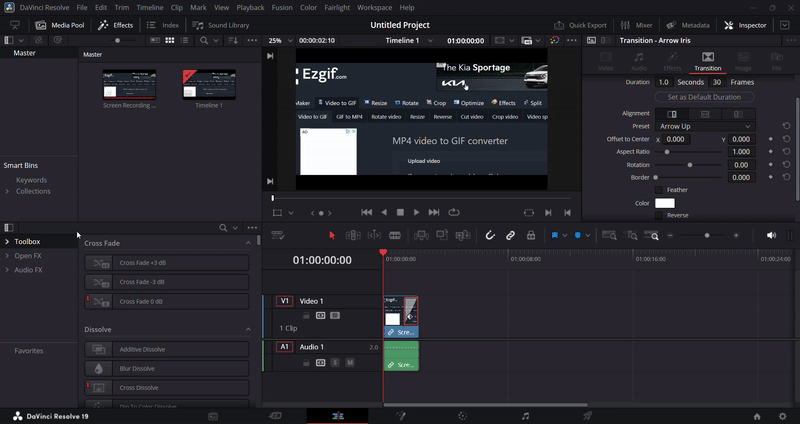
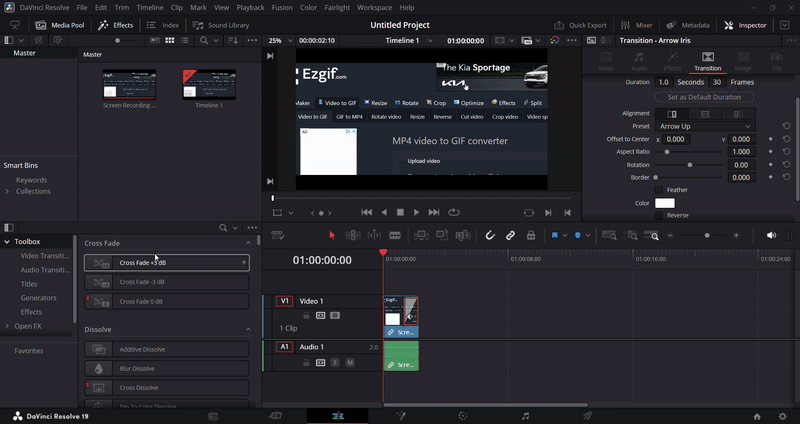
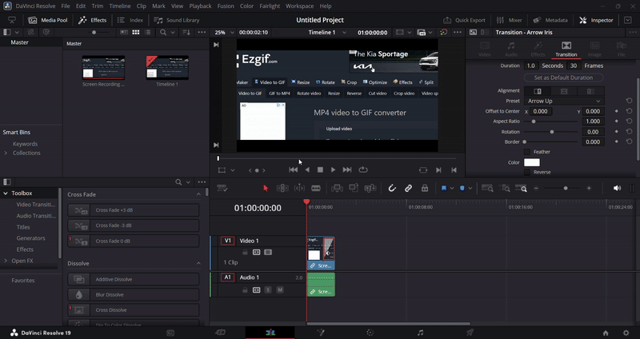
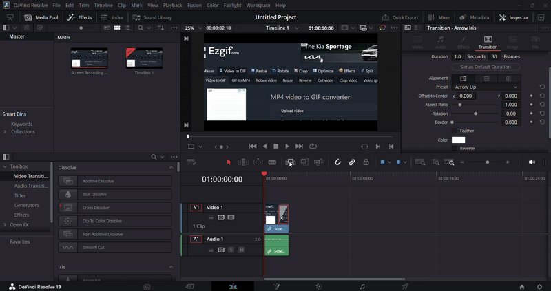
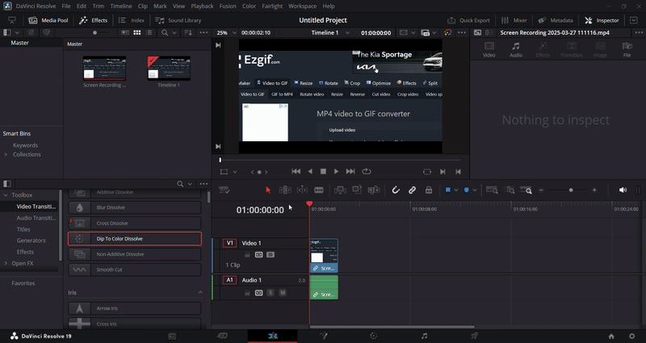
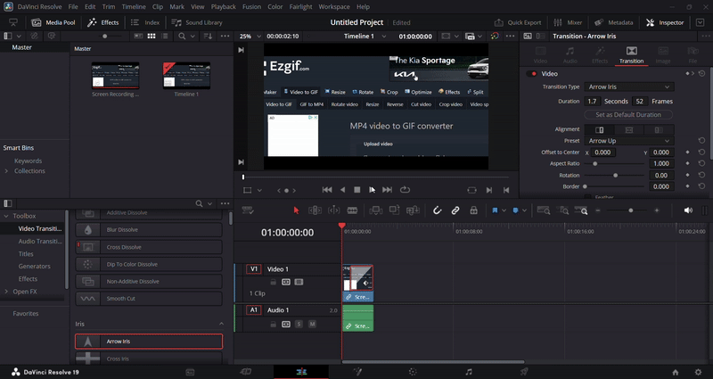

## Adding Transitions in DaVinci Resolve

#### Overview

Transitions help smoothly connect clips in your timeline, creating professional flow between scenes. DaVinci Resolve offers video transitions (like fades, wipes, and dissolves) and audio transitions (like crossfades) to polish your project.

#### Navigate to the Edit Page
1. Switch to the **Edit** page using the bottom navigation panel

    {: style="width:600px; height:350px; display: block; margin: 0 auto"}

#### Access the Toolbox
1. Locate the bottom-left panel

    {: style="width:600px; height:350px; display: block; margin: 0 auto"}

2. Click on the **Toolbox** tab

    {: style="width:600px; height:350px; display: block; margin: 0 auto"}

#### Select Transition Type
1. From the dropdown menu, choose:
    - **Video Transitions** for visual effects

        {: style="width:600px; height:350px; display: block; margin: 0 auto"}

    - **Audio Transitions** for sound crossfades

        {: style="width:600px; height:350px; display: block; margin: 0 auto"}

#### Choose a Transition
1. Browse the available transitions
2. Hover over options to see previews
3. Select your desired transition

    {: style="width:600px; height:350px; display: block; margin: 0 auto"}

#### Apply the Transition
1. Click and drag the transition to your timeline:
    - **Between clips**: For standard transitions
    - **Start/end of clip**: For fade-in/out effects

        {: style="width:600px; height:350px; display: block; margin: 0 auto"}

#### Adjust Transition Settings
1. Click on the transition in the timeline
2. Modify parameters:
    - Duration
    - Alignment
    - Custom settings

        {: style="width:600px; height:350px; display: block; margin: 0 auto"}

#### Preview the Transition
1. Play the clip in the **Preview** window

    {: style="width:600px; height:350px; display: block; margin: 0 auto"}

#### Refine the Transition
1. Repeat adjustments as needed
2. Try different transition types if unsatisfied

!!! success
    You have successfully added transitions to your video! You can move on to the next section.
